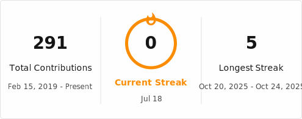

<h1 align="center">Hugo Viaud</h1>

<b>Software Developer</b> — Backend systems, automation & AI-assisted engineering

Currently building at <a href="https://github.com/Altorru">Agence CUBE</a> · Île d'Yeu, France

  
  

---

### About

I build backend systems, automation pipelines, and client-facing web products — most recently an automated analytics-verification platform (Laravel + Symfony Panther agents, orchestrated on Docker/Kubernetes) deployed against real production sites, and a portfolio of freelance web tools for small businesses on Île d'Yeu.

I care about software that actually ships: clear architecture over cleverness, automation over repetition, and measurable outcomes over feature lists. I use AI tooling (Copilot, LLM-assisted prototyping) as a working method, not a headline — it speeds up scaffolding and documentation so I can spend more time on the parts that need judgment.

Currently completing a Bachelor CDA (Concepteur Développeur d'Applications) in alternance, while running an auto-entreprise offering web development and automation for local businesses.

---

### Tech Stack

**Languages**

**Backend**

-00ADD8?style=flat-square&logo=go&logoColor=white)

**Frontend**

**Infra & DevOps**

**Automation & AI Tooling**

> Scope note: this list reflects what I actually use in production and freelance work — some of it (Laravel/Symfony/Nuxt stack, Kubernetes) runs on client projects that aren't public repositories.

---

### Featured Work

**Prestalys** — Marketplace connecting clients with local service providers
Full-stack web app with production-ready legal pages (CGU, mentions légales, privacy policy) built for RGPD/LCEN compliance.
*In development — not yet public.*

**hugoviaud.fr** — Freelance web & automation studio
Website creation, AI-driven automations, and custom business software for local SMEs on Île d'Yeu, backed by a structured prospecting pipeline (Python + n8n + Brevo).
🔗 [hugoviaud.fr](https://hugoviaud.fr)

---

### GitHub Activity

  

  

---

### Contact

- Website: [hugoviaud.fr](https://hugoviaud.fr)
- LinkedIn: [hugo-viaud-644b91385](https://www.linkedin.com/in/hugo-viaud-644b91385/)
- GitHub: [@Altorru](https://github.com/Altorru)
